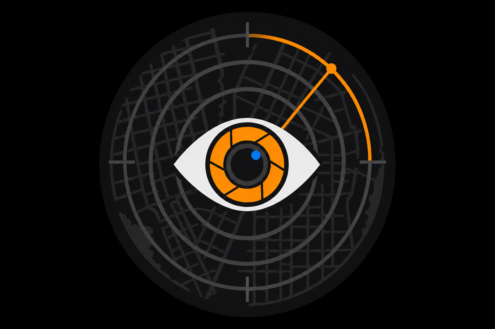
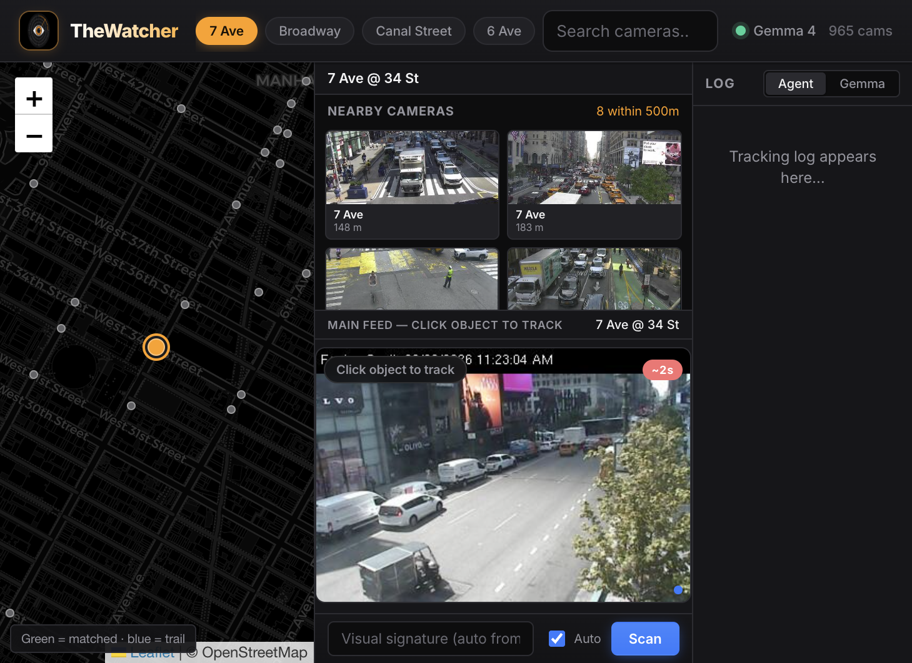
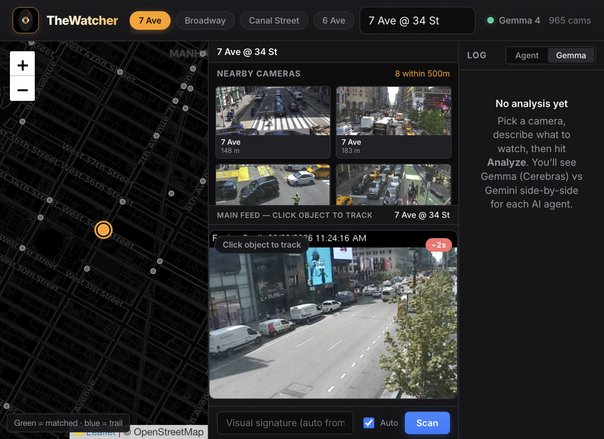
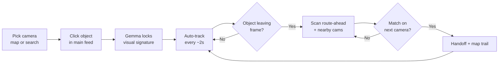
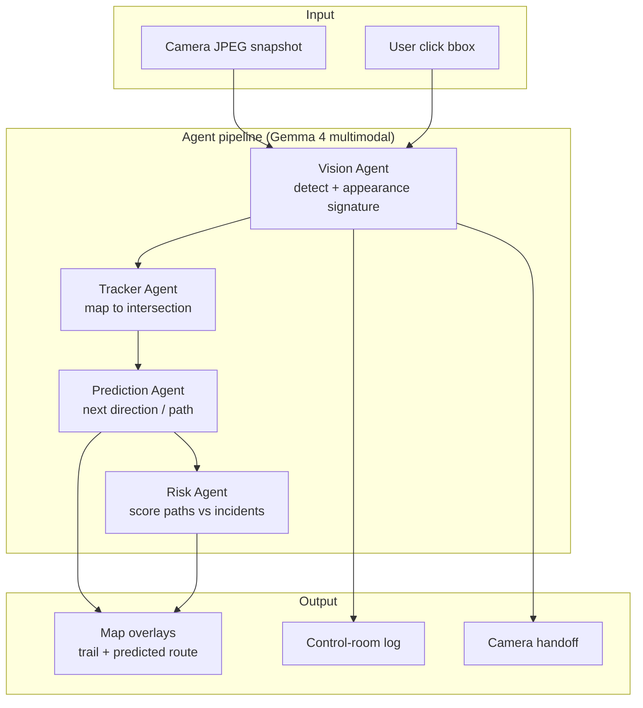
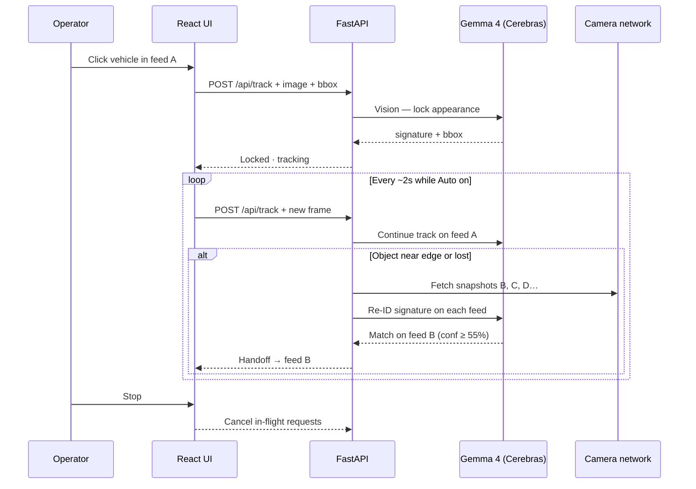

<p align="center">
  
</p>

<h1 align="center">TheWatcher</h1>

<p align="center">
  <strong>Live multi-camera tracking powered by Gemma 4 on Cerebras</strong><br/>
  Click an object once — four AI agents watch it move across a camera network in real time.
</p>

<p align="center">
  <a href="#quick-start">Quick Start</a> ·
  <a href="#how-it-works">How It Works</a> ·
  <a href="#use-cases">Use Cases</a> ·
  <a href="#architecture">Architecture</a> ·
  <a href="#hackathon">Hackathon</a>
</p>

---

## What is TheWatcher?

**TheWatcher** is a multimodal safety and tracking copilot. Operators pick a camera feed, click a vehicle or person, and the system:

1. **Locks** onto that exact object with a rich visual signature (color, clothing, plates, markings).
2. **Tracks** it frame-by-frame on the current camera.
3. **Predicts** where it is heading and draws the route on a live map.
4. **Searches** nearby cameras — and the camera ahead on the predicted path — to re-identify the same object.
5. **Hands off** automatically when Gemma confirms a match on the next feed.

Built for the **[Cerebras × Google DeepMind Gemma 4 Hackathon](https://docs.google.com/document/d/1s1N4Q4AQOx4L0josMhJ8iUgIAyMieuNJddo91NvfqBc/edit)**. The same pipeline works beyond traffic: **factories** (machine faults, safety zones) and **hospitals** (ER abnormalities, equipment, emergencies).

| | |
|---|---|
| **Primary model** | `gemma-4-31b` on Cerebras Inference API |
| **Input** | Live JPEG snapshots (Base64 multimodal) |
| **Agents** | Vision → Tracker → Prediction → Risk |
| **Cameras** | 900+ NYC DOT feeds (511NY) or your own RTSP/JPEG endpoints |
| **Latency** | Sub-second Gemma inference — shown live in the UI |

---

## Screenshots

### Control room dashboard

Pick a camera on the map, browse nearby feeds, click an object in the main feed, and watch the trail grow.



### Gemma vs Gemini comparison

Every agent step can run on **both** Gemma (Cerebras) and Gemini side-by-side — latency, tokens, and parsed JSON at a glance. Ideal for demoing **Speed in Action**.



---

## How it works

### Operator workflow (30 seconds)



| Step | What you do | What happens |
|------|-------------|--------------|
| **1** | Select **7 Ave @ 34 St** (or any NYC DOT camera) | Map centers; nearby feeds load |
| **2** | **Click** a car or person in the main feed | Gemma 4 builds a forensic appearance signature |
| **3** | Leave **Auto** on — tracking runs every ~2s | Bounding box updates; log shows concise status lines |
| **4** | Watch the **map** | Blue trail = cameras visited; orange line = predicted route |
| **5** | Object exits frame | System searches the camera **ahead** on the motion heading **and** neighbors |
| **6** | Match confirmed | Feed switches; green badges on matched nearby cameras |
| **7** | Click **Stop** | All inference, handoffs, and logging halt immediately |

### Multi-agent pipeline

On a full **Scan**, four specialized agents run in sequence. On the live **track** loop, a fast path uses Gemma vision + geo handoff only (quota-aware for 100 RPM).



### Cross-camera re-identification



---

## Use cases

The core idea is the same everywhere: **many fixed cameras, one thing to find, agents that coordinate.**

### NYC traffic (demo today)

- Click a taxi, van, or pedestrian on a live DOT feed.
- Follow it across intersections with map trail + route prediction.
- Risk agent weights paths using nearby 511NY incidents.

### Factory floor

| Watch for | How TheWatcher helps |
|-----------|----------------------|
| **Machine failure** | Click a robot arm, conveyor belt, or gauge once. Track abnormal motion or a part that stops moving; agents flag HALT when vision detects smoke, spill, or off-spec posture. |
| **Safety zones** | Track a forklift or worker near a restricted area. Prediction + Risk score whether they are heading into a hazard lane. |
| **Quality drift** | Lock onto a product on the line; re-ID the same unit across inspection cameras by color, label, or defect markers. |

*Implementation:* point `mode: factory` at your camera IDs and swap bundled sample images for plant floor JPEGs or RTSP proxies — no architecture change.

### Hospital / ER

| Watch for | How TheWatcher helps |
|-----------|----------------------|
| **ER overcrowding** | Track bed occupancy and hallway congestion across ward cameras; Risk escalates when paths converge on triage. |
| **Equipment movement** | Click a crash cart or portable monitor; follow it across floors when cameras hand off by appearance. |
| **Abnormal events** | Vision describes posture and scene context (person on floor, crowd surge, unattended stretcher); log surfaces ALERT lines for charge nurses. |
| **Emergency routing** | Prediction draws where a gurney is likely heading; next camera on the route is pre-scanned before the patient arrives. |

*Implementation:* `mode: hospital` with HIPAA-safe policies — **no face recognition**, generic object/pose language only, snapshot-based (not continuous recording).

---

## Architecture

```
┌─────────────────────────────────────────────────────────────────────────┐
│  frontend/          React + Vite + TypeScript + Leaflet                 │
│  ┌──────────┐  ┌─────────────────────┐  ┌─────────────────────────────┐ │
│  │ MapView  │  │ NearbyFeeds +       │  │ AgentChat + ComparisonView  │ │
│  │ trail +  │  │ SnapshotPanel       │  │ (log + Gemma vs Gemini)     │ │
│  │ routes   │  │ click-to-track      │  │                             │ │
│  └────┬─────┘  └──────────┬──────────┘  └──────────────┬──────────────┘ │
│       └───────────────────┴────────────────────────────┘                │
│                                    │ /api/* proxy                        │
└────────────────────────────────────┼────────────────────────────────────┘
                                     ▼
┌─────────────────────────────────────────────────────────────────────────┐
│  backend/           FastAPI (Python)                                    │
│  ┌─────────────┐  ┌──────────────────┐  ┌───────────────────────────┐ │
│  │ main.py     │  │ orchestrator.py  │  │ services/                 │ │
│  │ REST + JPEG │→ │ 4-agent pipeline │  │ nyc_data · detection ·    │ │
│  │ proxy       │  │ fast track path  │  │ multi_camera_track · route│ │
│  └─────────────┘  └────────┬─────────┘  └───────────────────────────┘ │
│                            │                                             │
│                   ┌────────┴────────┐                                    │
│                   ▼                 ▼                                    │
│            CerebrasGemma      GeminiProvider (optional baseline)        │
│            gemma-4-31b        gemini-2.0-flash                          │
└─────────────────────────────────────────────────────────────────────────┘
                                     │
                                     ▼
                          NYC 511NY · OSRM routing · OSM tiles
```

### Repository layout

| Path | Purpose |
|------|---------|
| `backend/app/agents/` | Prompts + orchestrator (Vision, Tracker, Prediction, Risk) |
| `backend/app/providers/` | Cerebras Gemma + optional Gemini clients |
| `backend/app/services/` | Detection, geo handoff, nearby scan, NYC data |
| `frontend/src/components/` | Map, feeds, snapshot panel, agent log |
| `frontend/src/utils/mapPaths.ts` | Road-following prediction lines on the map |
| `docs/screenshots/` | README images |

---

## Quick start

> **Only `CEREBRAS_API_KEY` is required.** Everything else degrades gracefully (sample cameras, mocked Gemini column, free map tiles).

### 1. Configure environment

```bash
cp .env.example backend/.env
# Edit backend/.env — add your Cerebras API key
```

```env
CEREBRAS_API_KEY=your_key_here
CEREBRAS_MODEL=gemma-4-31b
```

Optional: `GEMINI_API_KEY` (comparison tab), `NY511_API_KEY` (live NYC cameras), `VITE_GEOAPIFY_KEY` (map tiles).

### 2. Backend

```bash
cd backend
python -m venv .venv
source .venv/bin/activate          # Windows: .venv\Scripts\activate
pip install -r requirements.txt
python -m app.main                 # http://127.0.0.1:8000
```

Health check: [http://127.0.0.1:8000/api/health](http://127.0.0.1:8000/api/health)

### 3. Frontend

```bash
cd frontend
npm install
npm run dev                        # http://localhost:5173
```

### 4. Try it

1. Open **http://localhost:5173**
2. Confirm the green **Gemma 4** dot in the top bar
3. Pick **7 Ave @ 34 St** (recommended chip or search)
4. **Click** a vehicle or person in the main feed
5. Watch the log, map trail, and nearby camera matches update

### Production build

```bash
cd frontend && npm run build       # output in frontend/dist/
cd backend && python -m app.main   # serve API; static hosting for dist/
```

For deployment, set `WATCHER_CORS_ORIGINS` to your hosted frontend URL.

---

## API

| Method | Endpoint | Description |
|--------|----------|-------------|
| `GET` | `/api/health` | Provider status, model IDs, snapshot interval |
| `GET` | `/api/cameras` | All cameras (511NY or bundled samples) |
| `GET` | `/api/cameras/{id}/snapshot` | Proxied live JPEG (no CORS issues) |
| `POST` | `/api/watch` | Full 4-agent pipeline + optional dual-model compare |
| `POST` | `/api/track` | Fast live loop (Gemma vision + multi-cam handoff) |
| `GET` | `/api/route` | Road-following polyline between two lat/lng points |

**Track request body (simplified):**

```json
{
  "camera_id": "uuid",
  "object_description": "clicked object — describe every visible detail",
  "bounding_box": { "x": 420, "y": 310, "width": 120, "height": 120 },
  "image_data_uri": "data:image/jpeg;base64,...",
  "mode": "nyc"
}
```

---

## Hackathon alignment

Built for **[Gemma 4 on Cerebras](https://inference-docs.cerebras.ai/)** — multimodal image input, OpenAI-compatible Chat Completions, `gemma-4-31b`.

| Track | How TheWatcher fits |
|-------|---------------------|
| **Multiverse Agents** | Four cooperating agents; vision reads live camera frames; cross-camera handoff |
| **People's Choice** | One-click demo on real NYC feeds; speed badge shows Cerebras latency live |
| **Enterprise Impact** | Same stack for factory safety and hospital ops — see [Use cases](#use-cases) |

**Demo video tips (≤60s):** show click-to-track → log lines → map trail → handoff to next camera → flash the **ms** badge next to Gemma 4. Optional: split-screen with Gemini latency in the comparison tab.

---

## Ethics & limitations

- **No face recognition or PII** — generic objects (vehicles, people-as-silhouettes, equipment) only.
- **Snapshot-based** — NYC DOT refreshes ~every 2s; not continuous video storage.
- **Probabilistic re-ID** — appearance matching across angles/lighting is scored with confidence; the UI shows percentages, not false certainty.
- Factory and hospital modes are **intended for simulated or consented deployments** — follow your org's privacy and HIPAA policies.

---

## Environment reference

See [`.env.example`](.env.example) for the full list. Highlights:

| Variable | Required | Purpose |
|----------|----------|---------|
| `CEREBRAS_API_KEY` | Yes | Gemma 4 inference |
| `CEREBRAS_MODEL` | No | Default `gemma-4-31b` |
| `GEMINI_API_KEY` | No | Side-by-side comparison column |
| `NY511_API_KEY` | No | Live NYC camera list + alerts |
| `VITE_GEOAPIFY_KEY` | No | Brighter map tiles (OSM fallback works) |
| `WATCHER_CORS_ORIGINS` | No | Frontend URLs allowed to call the API |

---

## License

MIT — see project root. NYC camera data subject to NY DOT / 511NY terms of use.

---

<p align="center">
  <sub>Built with Gemma 4 on Cerebras · TheWatcher © 2026</sub>
</p>
